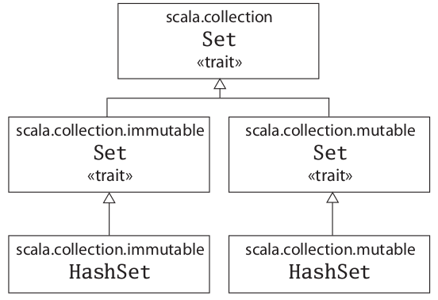
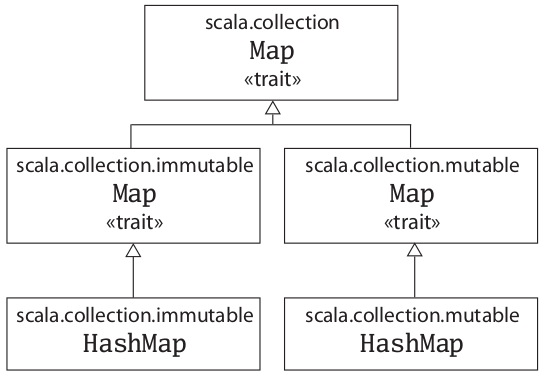

Scala common tutorial
================================
This repository services as a cheat sheet of scala and contains my learning experience from the following resources:
* [Scala By Example](http://www.scala-lang.org/docu/files/ScalaByExample.pdf) by Martin Odersky
* [A Scala Tutorial
for Java programmers](http://www.scala-lang.org/docu/files/ScalaTutorial.pdf) by Michel Schinz, Philipp
Haller

Copy&Paste from the above resourcess is unavoidable simpy because I want to remember those hardcores!

Howerver, if there's any issue, don't hesitate to shoot me an email: jiefeng.hopkins@gmail.com 


Compile
---------
`scala -classpath .   Filename.scala`

Run
---
#### Run as shell script
```scala
#!/bin/sh
exec scala "$0" "$@"
!#
//scala program goes here
```
[EXAMPLE](./examples/using-arguments.scala)


Examples
--------


Terms
-----
`() => Unit` is the type of all functions which take no arguments and return nothing

#### Class comparison and conversion

* *Comparison*: `object.isInstanceOf[class]`
* *Conversion*: `= object.asInstanceOf[class]`

####  Call-by-value evaluation by using `=>`
```scala
def constOne(x: Int, y: => Int) = 1
```

#### Tail calls
If the last action of a function is a call to another (possibly the same) function, only a single stack frame is needed for both functions. Such calls are called *tail calls*.

#### Higher-order function
Functions which take other functions as parameters or return them as results as results are called *higher-order* functions. Examples:
```scala
def sum(f: Int => Int, a: Int, b: Int): Int =
  if (a > b) 0 else f(a) + sum(f, a + 1, b)
```

#### Anonymous functions
An anonymous function is an expression that evaluates to a function; the function is defined without giving it a name. Examples:
```scala
(x: Int) => x * x
(x: Int, y: Int) => x * y
```

#### Currying
A curried function definition looks like: `def f (args_1) ... (args_n) = E`. Examples:
```scala
def sum(f: Int => Int)(a: Int, b: Int): Int =
  if (a > b) 0 else f(a) + sum(f)(a + 1, b)
// or
def sum(f: Int => Int): (Int, Int) => Int = {
  def sumF(a: Int, b: Int): Int =
    if (a > b) 0 else f(a) + sumF(a + 1, b)
  sumF
}
// tail recursive 
def sum(f: Int => Int)(a: Int, b: Int): Int = {
  def iter(a: Int, result: Int): Int = {
    if (a > b) result
    else iter(a+1, result + f(a))
  }
  iter(a, 0)
}
```
Function calls:
```scala
def sumSquares = sum(x => x*x)
sumSquares(1, 100)
// or
sum(x => x*x)(1,100)
```

#### Abstract class
```scala
abstract class IntSet{
  def incl(x: Int): IntSet
  def contains(x: Int): Boolean
}
```
Two good points:

* *deferred* members which are declared but which do not have an implementation
* Since an abstract class might have unimplemented members, no objects of that class may be created using **new**

#### Traits V.S. Java interfaces
Traits are just like Java's interfaces expect that all methods in Java interfaces are by definition abstract while methods in scala traits can have real bodies.

Another significant difference between Java's interfaces and Scala's traits is that you can mix in traits when instantiating scala trait. [Example](traits/Motivative.scala):
```scala
trait Motivative{
  def create() = "Do some stuff "
}
trait Creative extends Motivative{
  override def create() = super.create() + "new!"
}
class Human extends Motivative{
  def greet() = println("Hello world!")
}
class Entrepreneur extends Human{
}
val elon = new Entrepreneur with Creative
println(elon.create()) // will print "Do some stuff new!"
```

* Example1:
```scala
trait IntSet{
  def incl(x: Int): IntSet
  def contains(x: Int): Boolean
}
```
* Example2:
```scala
trait Friendly {
  def greet() = "Hi"
}
```
Like Java interfaces, Traits can **extend** zero to many traits. Example:
```scala
class Animal extends Friendly{
  override def greet() = "Woof"
}
```

#### Covariant subtyping. 
In the example below, if *T* is a subtype of type *S*, that implies that **Stack[S]** is a subtype of **Stack[T]**.
```scala
class Stack[+A]{
}
```
#### Contra-variant subtyping. 
In the example below, if *T* is a subtype of type *S*, that implies that **Stack[T]** is a subtype of **Stack[S]**.
```scala
class Stack[-A]{
}
```
#### List & Tuple
* List & tuple are immutable
* List contains elements of the same type, while tuple can contain different types of elements
* Once you defined a tuple, you can access its elements via a dot, underscore, and the **one-based** index of the element. For example: 

  ```scala
  val pair = (99, "Comprehend")
  println(pair._1)
  println(pair._2)
  ```
* The actual type of a tuple depends on the number of elements it contains and the types of those elements. Thus, the type of (99, "Comprehend") is Tuple2[Int, String] . The type of ('C', 'pre', "hend", 5, 2, 0) is Tuple6[Char, String, String, Int, Int, Int] .
#### Set & Map
* Set & Map are implemented in both *immutable* and *mutable* which suite *functional* and *imperative* programming respectively. Their class hierarchies are:


* Immutable Set & Map are automatically imported, while mutable ones need to import specifically. Code example: 

```scala
//mutable set
import scala.collection.mutable.HashSet
val wordSet = new HashSet[String]
wordSet += "Apple"
wordSet += ("Banana", "Orange")
println(wordSet.contains("Pear"))

//immutable set
val wordSet = Set("Apple", "Orange")
println(wordSet)

//mutable map
import scala.collection.mutable.HashMap
val identityMap = new HashMap[Int, String]
identityMap += (1 -> "Comprehend System")
identityMap += (2 -> "The Johns Hopkins University")
identityMap += (3 -> "Jie Feng")
println(identityMap(2))

//immutabe map
val universityName = Map(
  "JHU" -> "Johns Hopkins University",
  "CMU" -> "Carnegie Mellon University",
  "MIT" -> "Massachusetts Institute of Technology"
)
println(universityName(2))
```
#### Functional Objects 
A comprehensive explanation is provided in [Rational.scala](functional_objects/Rational.scala) which implements class for *rational numbers*.
#### Singleton objects
* Defined using the keyword **object**
* Scala does not allow static fields or methods, but it allows you to *create singleton objects* to do the same thing.
* A *singleton object* should not be instantiated with *new*
* It is essentially automatically instantiated the first time it is used.
* A *singleton object* can share the same name with a class, and when it does, the singleton is called the class’s **companion object**. It is called a **stand-alone** object if it is not a *companion object*
* A *companion object* differs from a *companion object* that it has a few special privilejjges, such as access to the private members of like-named class.
* [A comprehensive example](examples/Animal.scala)

#### [Literals](Literals.md)
#### Identifiers 

#### Exceptions
Syntax:
```scala
try {
  doSomething()
}
catch {
  case ex: IOException => println("Oops!")
  case ex: NullPointerException => println("Oops!!")
}
```

* **alphanumeric identifier**: a letter or '_', followed by letters, digits, or '_'. '$' is also a letter, however it is reserved for identifiers generated by the Scala compiler. Examples: `hophacker  x1 _out_  MAX_DECIMAL_NUMBER  CamelCase`
* **operator identifier**: one or more operator characters. Example: `+ ++ ::: <?> :->`
* **mixed identifier**: a alphanumeric identifier, followed by '_' and an operator identifier. Example: 
`vector_+   success_?   myval_=`

* **literal identifier**: an arbitrary string enclosed in back-ticks. One usage: Since *yield* is a reserved word in Scala, one cannot write **Thread.yield()**, instead, **Thread.'yield'()** is OK in this case.

#### Scala shell commands
* **:load**, load a scala file
* **:replay**, execute all the commands executed so far in scala shell
